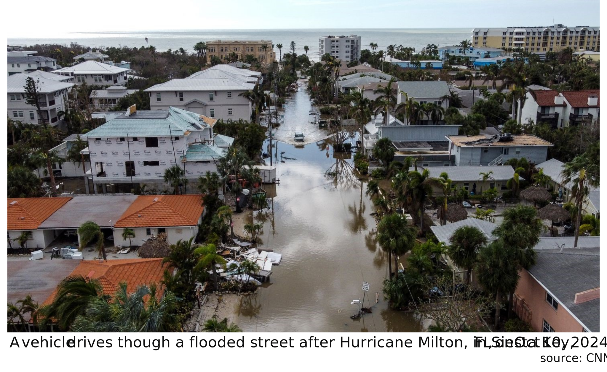
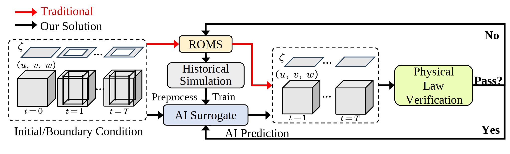
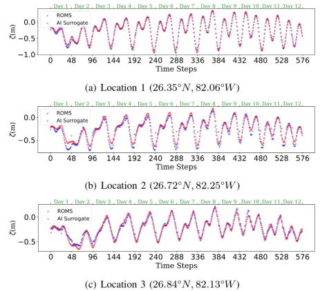
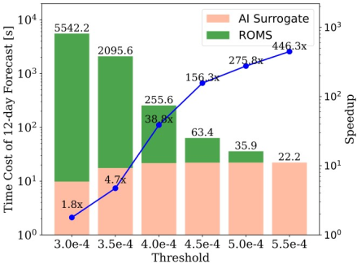
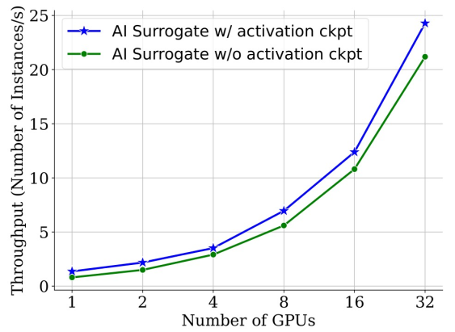
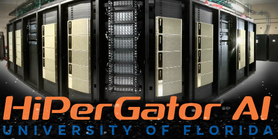

  

## Project Team

- **PIs**: [Dr. Zhe Jiang](https://www.jiangteam.org/index.html) (CISE at UF, Lead
  PI), [Dr. Jie Ren](https://jren73.github.io/) (CS at William & Mary, Site PI)
- **Senior Personnel**: [Dr. Maitane Olabarrieta](https://www.olabarrieta-coastal.com/) (Civil & Coastal Engineering at
  UF)
- **Research Scientists:** Dr. Jose Maria Gonzalez Ondina (UF)
- **Ph.D. Students**: Zelin Xu (UF), Yupu Zhang (UF)

## Collaborators and Partners

- UF Center for Coastal Solutions
- NVIDIA AI Technology Center (NVAITC)
- NOAA's National Ocean Service

## Introduction
Nearly 900 million people live in low-lying coastal zones around the world and bear the brunt of impacts from more
frequent and severe hurricanes and storm surges. Oceanographers simulate ocean current circulation along the coasts to
develop early warning systems that save lives and prevent loss and damage to property from coastal hazards.
Traditionally, such simulations are conducted using coastal ocean circulation models such as the Regional Ocean Modeling
System (ROMS), which usually runs on an HPC cluster with multiple CPU cores. However, the process is time-consuming and
energy expensive. While coarse-grained ROMS simulations offer faster alternatives, they sacrifice detail and accuracy,
particularly in complex coastal environments.

Recent advances in deep learning and GPU architecture have enabled the development of faster AI (neural network)
surrogates.
This project introduces an AI surrogate to simulate coastal ocean circulation. Our approach not only accelerates
simulations but also incorporates a physics-based constraint (water mass conservation law) to detect and correct
inaccurate results, ensuring reliability while minimizing manual intervention.
We develop a fully GPU-accelerated workflow, optimizing the model training and inference pipeline on NVIDIA DGX-2 A100
GPUs.

Our current experimental results demonstrate that our AI surrogate reduces the time cost of **12-day** forecasting of
traditional ROMS simulations from 9,908 seconds (on 512 CPU cores) to 22 seconds (on one A100 GPU), 
achieving over **450x** speedup while maintaining high-quality
simulation results. This work contributes to oceanographic modeling by offering a fast, accurate, and physically
consistent alternative to traditional simulation models, particularly for real-time forecasting in rapid disaster
response.

## Overall Workflow

- ROMS historical simulations are pre-processed and used to train the AI surrogate.
- Trained AI surrogate takes initial and boundary conditions as inputs and predicts the interior values.
- Verification module: checks physical law adherence of AI predictions and switches to ROMS if the surrogate fails the
  check.

## ROMS and AI Surrogate 12-day Forecast Visualization

## ROMS and AI Surrogate Free Surface Elevation ζ Predictions Comparisons at Random Locations

  

## Speedup Comparison with MPI-Based ROMS

  

End-to-end efficiency of integrated workflow with AI surrogate inference results verification and correction.

- x-axis: various water mass residual thresholds
- bar heights: the total execution time of the workflow
- blue line: the speedup factor of the AI surrogate-based workflow

## Training Scalability

  

Scalability of AI surrogate training with and without activation checkpointing, using 1 to 32 GPUs.
Experiments use 1, 2, 4, and 8 GPUs on a single compute node,
while 16 and 32 GPU experiments utilize 2 and 4 compute nodes, respectively.

## References
- Zelin Xu, Jie Ren, Yupu Zhang, Jose Maria Gonzalez Ondina, Maitane Olabarrieta, Tingsong Xiao, Wenchong He, Zibo Liu, Shigang Chen, Kaleb Smith, and Zhe Jiang. "A Fast AI Surrogate for Coastal Ocean Circulation Models." arXiv preprint, 2024. [[Paper](https://arxiv.org/abs/2410.14952)]
- Wenchong He, Zhe Jiang, Tingsong Xiao, Zelin Xu, Shigang Chen, Ronald Fick, Miles Medina, and Christine Angelini. "A Hierarchical Spatial Transformer for Massive Point Samples in Continuous Space." Advances in Neural Information Processing Systems (NeurIPS), 2023. [[Paper](https://proceedings.neurips.cc/paper_files/paper/2023/file/6a0480190bbe6b622c7f1d3aa9be9c0f-Paper-Conference.pdf)]
- Megan Sam. "Scientists train AI models to predict natural disasters faster" UF CCS News, August 9, 2024. [[Link](https://ccs.eng.ufl.edu/scientists-train-ai-models-to-predict-natural-disasters-faster/)]
- Andrew R. Chow. "How Meteorologists Are Using AI to Forecast Hurricane Milton and Other Storms." TIME, October 9, 2024. [[Link](https://time.com/7081372/ai-hurricane-forecasting/)]

## Acknowledgement

